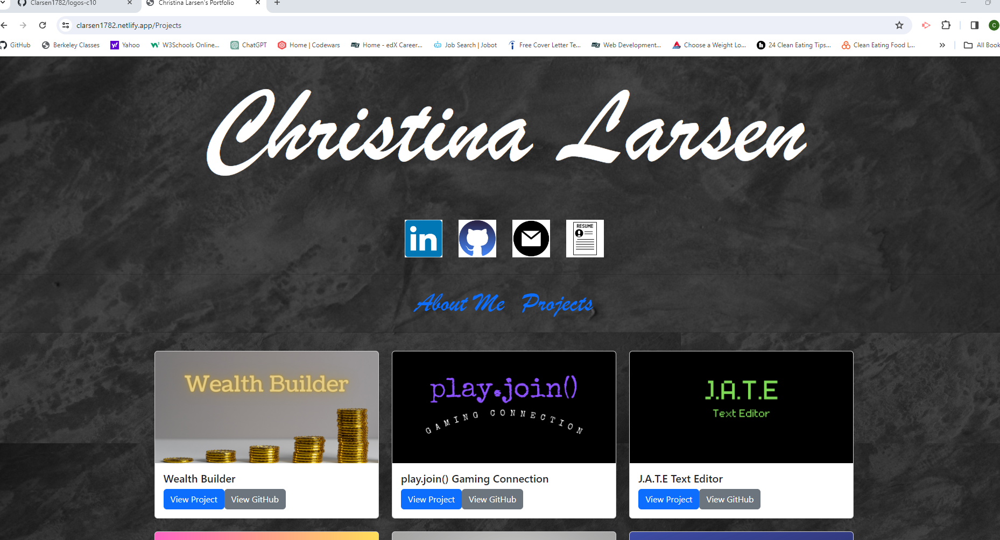

# Christina Larsen's Portfolio

Deployed Link: [Christina Larsen's Portfolio](https://clarsen1782.netlify.app/)

## Table of Contents (Optional)

* [Installation](#installation)
* [Usage](#usage)
* [Credits](#credits)
* [License](#license)

## Installation

There is no installation needed to view my React-Bootstrap portfolio. 

## Usage 

Greetings! I'm Christina Larsen, a recent graduate of the UC Berkeley Extension Full Stack Web Development Certification course (December 2023). Welcome to my React-Bootstrap portfolio, a snapshot of the skills and knowledge I've gained on my journey into web development.

While this portfolio represents just the beginning of my learning, it serves as a comprehensive overview of the diverse skills I've acquired. I'm excited about the prospect of expanding this page with new projects as I continue to grow in the field.

Thank you for exploring my portfolio, and I look forward to sharing more of my coding adventures with you in the future!

## Credits

* React-Bootstrap Docs - [https://react-bootstrap.github.io/](https://react-bootstrap.github.io/)    
* Netlify - [https://docs.netlify.com/](https://docs.netlify.com/)
* Vite - [https://vitejs.dev/guide/](https://vitejs.dev/guide/)
* React - [https://react.dev/](https://react.dev/)
* Bootstrap - [https://getbootstrap.com/](https://getbootstrap.com/)

## License

[MIT License](https://github.com/microsoft/vscode/blob/main/LICENSE.txt)

